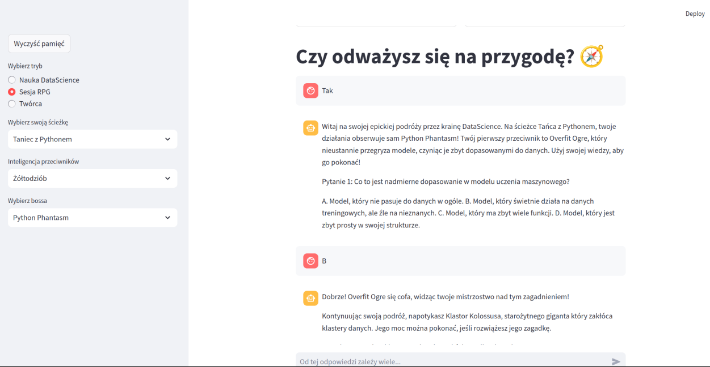

<!DOCTYPE html>
<html lang="en">
<head>
    <meta charset="UTF-8">
    <meta name="viewport" content="width=device-width, initial-scale=1.0">
    <title>AI Data Science Learning App</title>
    
</head>
<body>

    <h1 class="title">🌟 Welcome to My Data Science Learning App! 🌟</h1>

    <section class="section">
        
Hello! 🖐

        
Welcome to the revolutionary app that leverages artificial intelligence to teach data science through an engaging chat interface. 🚀 Start your journey into the world of data science with personalized support.
        Please see github link <a href="https://github.com/krzysztofkleszcz50/data_playground3.git">here</a>. 
        

    </section>

    <section class="section">
        <h2><b>About the App</b></h2>
        
Our app offers three unique modes to cater to your learning style:

        <ul>
            <li>Normal Mode: Traditional lessons and exercises to build your data science knowledge step by step.</li>
            <li>Game Mode: Embark on an exciting adventure where you learn data science concepts through quests and challenges. 🕹️</li>
            <li>Chat Settings Creator: Customize your learning experience by adjusting chat settings to fit your preferences. ⚙️</li>
        </ul>
    </section>

    <section class="section">
        <h2><b>Key Features</b></h2>
        
Our app includes the following features to enhance your learning experience:

        <ul>
            <li>Interactive Chat Lessons 💬</li>
            <li>Personalized Feedback and Support 🤖</li>
            <li>Engaging Quizzes and Challenges 📊</li>
            <li>Customizable Learning Paths 📚</li>
        </ul>
    </section>

    
 
         
    

</body>
</html>
