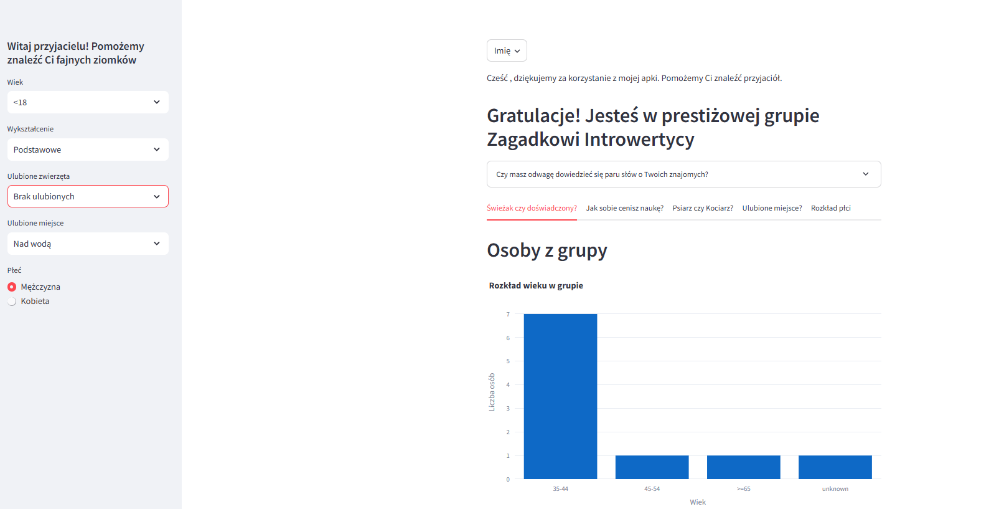
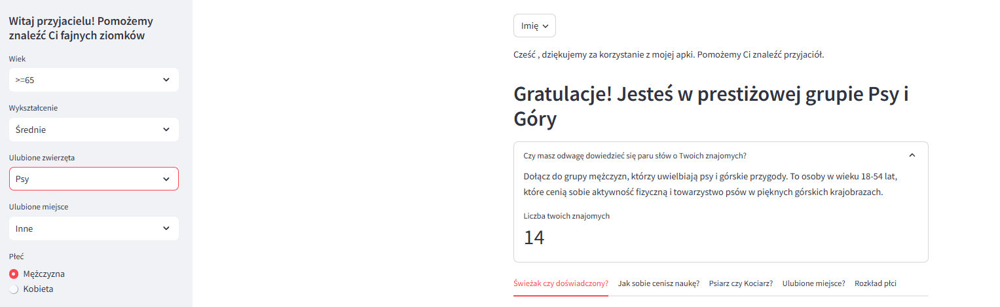

<!DOCTYPE html>
<html lang="en">
<head>
    <meta charset="UTF-8">
    <meta name="viewport" content="width=device-width, initial-scale=1.0">
    <title>Friendship App</title>
    
</head>
<body>

    <h1 class="title">🌟 Welcome to My Friendship App! 🌟</h1>

    <section class="section">
        
Hello! 🖐

        
Welcome to the ultimate app for finding and making new friends. 🌐 Connect, explore, and build meaningful relationships with people who share your interests. Please see linki to this this app
        <a href="https://apptofindfriends-v2.streamlit.app/">here</a>.
        Please see github link <a href="https://github.com/krzysztofkleszcz50/app_to_find_friends">here</a>.  🚀

    </section>

    <section class="section">
        <h2><b>About the App</b></h2>
        
Our app focuses on bringing people together by offering features such as:

        <ul>
            <li>User Profiles 👤</li>
            <li>Interest-Based Matching 💬</li>

    <section class="section">
        <h2><b>Screenshhots</b></h2>
        
Please see screenshots below 📈

    </section>

    
 
         
        
    

</body>
</html>
