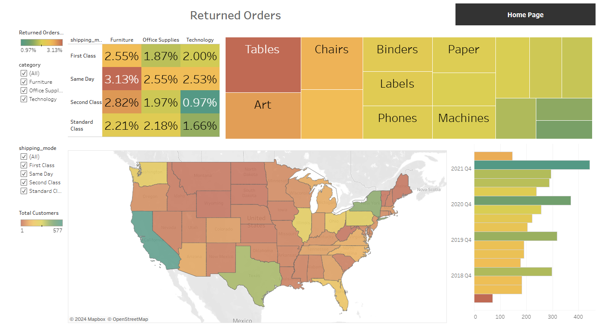

<!DOCTYPE html>
<html lang="en">
<head>
    <meta charset="UTF-8">
    <meta name="viewport" content="width=device-width, initial-scale=1.0">
    <title>Tableau Project</title>
    
</head>
<body>

    <h1 class="title">🌟 Welcome to My Tableau Project! 🌟</h1>

    <section class="section">
        
Hello! 🖐

        
Welcome to my Tableau project where data comes to life through interactive visualizations. 🚀 Dive into the world of data insights with personalized support. Explore the project on Tableau Public <a href="https://public.tableau.com/app/profile/krzysztof.kleszcz/viz/SalesSuperstore_17308345887650/SalesDetails">here</a>. 
        

    </section>

    <section class="section">
        <h2><b>About the Project</b></h2>
        
This Tableau project offers in-depth analysis and visualization of sales data. Key features include:

        <ul>
            <li>Sales Performance: Track sales performance over time and identify trends.</li>
            <li>Customer Insights: Gain insights into customer behavior and preferences.</li>
            <li>Product Analysis: Analyze product performance and inventory levels.</li>
        </ul>
    </section>

    <section class="section">
        <h2><b>Key Features</b></h2>
        
Explore the following features to enhance your understanding of the data:

        <ul>
            <li>Interactive Dashboards 📊</li>
            <li>Data Filters and Drill-Downs 🔍</li>
            <li>Customizable Views 📈</li>
        </ul>
    </section>

    
 
        
        
    

</body>
</html>
